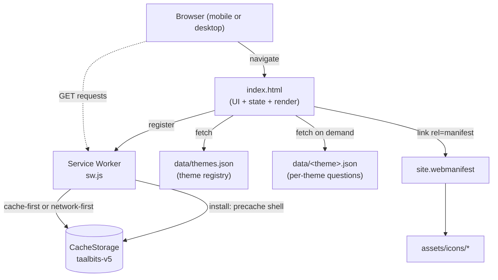
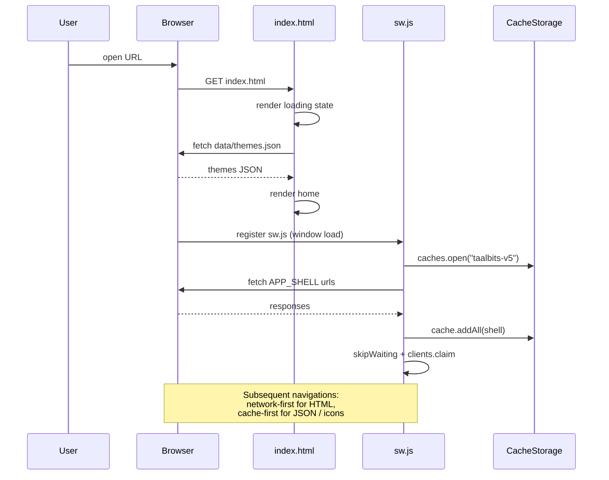
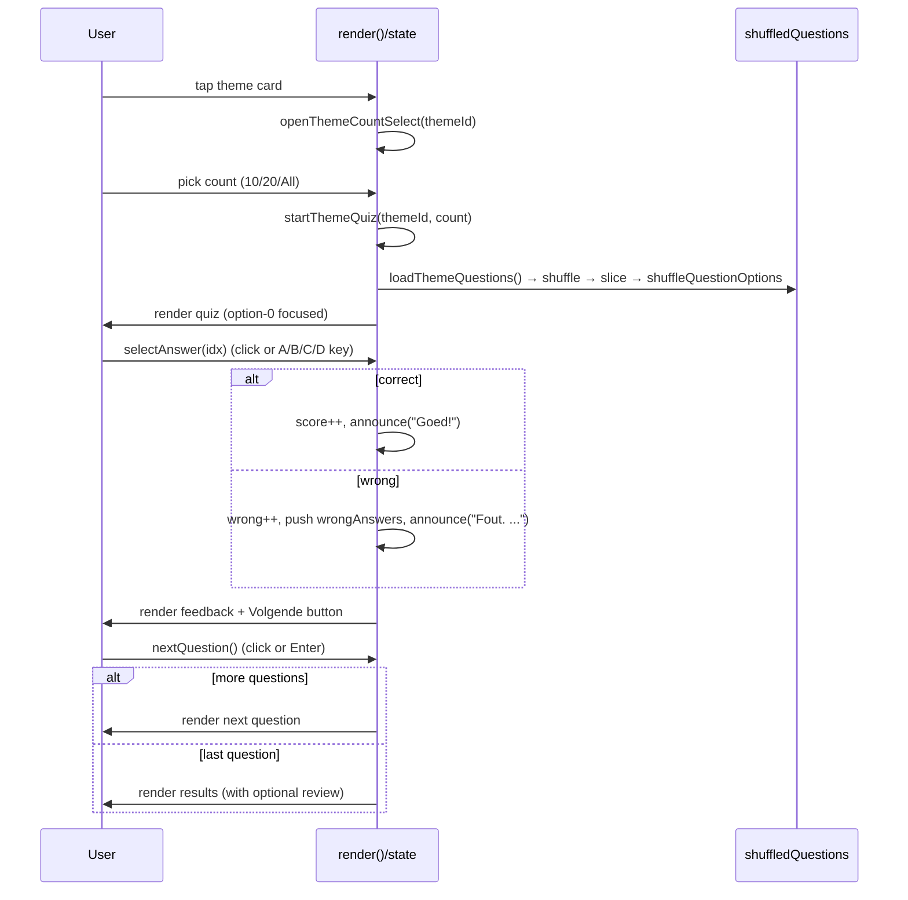

# Taalbits — Technical Documentation

## Overview

Taalbits is a mobile-first Dutch practice web app for B1+ / B2 learners. It runs entirely client-side: a single static HTML page plus JSON question banks served from `data/`. Each session is a short quiz over one verb theme (Dutch separable/compound verbs like *opnemen*, *aannemen*) or a fill-in preposition theme (*wachten op*, *denken aan*). A service worker caches the app shell and question files so the app works offline after first load, and a web manifest makes it installable as a PWA. There is no build step, no framework, and no backend.

## Tech Stack

| Layer | Technology | Version | Source |
|---|---|---|---|
| Markup / UI | Vanilla HTML5 | — | [index.html](index.html) |
| Styling | Inline CSS (CSS custom properties, dark theme) | — | [index.html:30](index.html:30) |
| Logic | Vanilla JavaScript (ES2017+: `async/await`, template strings, optional spread) | — | [index.html:257](index.html:257) |
| Fonts | DM Sans + DM Mono (Google Fonts) | — | [index.html:28](index.html:28) |
| Offline / PWA | Service Worker API + Web App Manifest | Cache name `taalbits-v5` | [sw.js:1](sw.js:1), [site.webmanifest](site.webmanifest) |
| Data | Static JSON files | — | [data/](data) |
| Hosting | GitHub Pages (static) | — | README + branch convention |
| Build tools | None | — | No `package.json`, no lockfile |

> ⚠️ Unverified: GitHub Pages deployment is implied by `README.md` and the project layout. There is no GitHub Pages workflow committed in the repo (no `.github/workflows/`). Confirm via repo settings.

## Architecture



Component map (file → role):

- [index.html](index.html) — entire app shell: CSS, DOM, state machine, render functions, keyboard handling, service-worker registration.
- [sw.js](sw.js) — install/activate/fetch handlers; precaches the shell and JSON; network-first for HTML navigations, cache-first for everything else.
- [site.webmanifest](site.webmanifest) — PWA metadata: name, theme color `#0F1117`, standalone display, icons.
- [data/themes.json](data/themes.json) — registry of selectable themes (id, label, description, emoji, color, optional `type`).
- [data/&lt;id&gt;.json](data) — question bank for each theme id.

## Data Flow

```mermaid
flowchart LR
  A["User opens<br/>index.html"] --> B["loadThemes()<br/>fetch data/themes.json"]
  B --> C["THEMES array<br/>render home"]
  C --> D["User taps theme card"]
  D --> E["openThemeCountSelect()<br/>render count-select"]
  E --> F["User picks 10 / 20 / All"]
  F --> G["startThemeQuiz()<br/>fetch data/&lt;id&gt;.json"]
  G --> H["shuffle questions<br/>(+ MC option shuffle)"]
  H --> I["render quiz state machine"]
  I --> J["selectAnswer / submitFillAnswer"]
  J --> K{"qIdx == last?"}
  K -->|no| I
  K -->|yes| L["renderResults()<br/>+ optional renderReview()"]
```



All state lives in a single in-memory object — there is no localStorage, sessionStorage, IndexedDB, or remote sync ([index.html:272](index.html:272)). Per-theme question arrays are memoized in `questionCache` so repeat sessions skip the network ([index.html:293](index.html:293)).

## Key Sequences

### 1. First load + service-worker bootstrap



Source: [index.html:292](index.html:292), [index.html:562](index.html:562), [sw.js:31](sw.js:31), [sw.js:51](sw.js:51).

### 2. Multiple-choice question flow



Source: [index.html:307](index.html:307), [index.html:367](index.html:367), [index.html:389](index.html:389), [index.html:521](index.html:521).

## Data Model

No database. The runtime types are JSON shapes loaded from `data/`.

**Theme registry** ([data/themes.json](data/themes.json))

| Field | Type | Required | Notes |
|---|---|---|---|
| `id` | string | yes | Used as filename: `data/<id>.json` |
| `label` | string | yes | Display label (e.g. `"-komen"`) |
| `description` | string | yes | Sub-label shown on full-width cards |
| `emoji` | string | yes | Icon glyph |
| `color` | string (hex) | yes | Accent / progress-bar color |
| `type` | `"mc"` \| `"fill"` | no | Defaults to `"mc"` if absent ([index.html:280](index.html:280)) |

**Multiple-choice question** (e.g. [data/komen.json](data/komen.json))

| Field | Type | Notes |
|---|---|---|
| `sentence` | string | Cloze sentence; the gap is rendered with the literal underscores from the JSON |
| `options` | string[] (length 4) | Choices A–D ([index.html:266](index.html:266)) |
| `correct` | integer | Index into `options` |
| `explanation` | string | Shown after answering |
| `wrongExplanations` | `{ [index: string]: string }` | Per-wrong-option rationale; keys remapped after option shuffle ([index.html:295](index.html:295)) |
| `hint` | string | Revealed via the Hint button / `H` key |
| `tense` | `"infinitive"` \| `"perfectum"` \| `"imperfectum"` \| `"present"` | Optional. Tags the verb form the gap tests. Defaults to `"infinitive"`. |
| `wordOrder` | `"standard"` \| `"inversion"` \| `"bijzin"` | Optional. Tags the Dutch sentence structure. Defaults to `"standard"`. |
| `register` | `"neutraal"` \| `"formeel"` \| `"spreektaal"` | Optional. Tags the language register. Defaults to `"neutraal"`. |

The three tag fields are forward-compatible: present in JSON, ignored by the current UI, and reserved for future filter chips and stats. Authoring guidance for distributions is in [Authoring guide](#authoring-guide) below.

**Fill-in question** ([data/preposities.json](data/preposities.json))

| Field | Type | Notes |
|---|---|---|
| `sentence` | string | Cloze sentence with `___` |
| `answer` | string | Canonical answer (shown on wrong) |
| `acceptedAnswers` | string[] | Case-insensitive match list ([index.html:374](index.html:374)) |
| `explanation` | string | Shown after answering |
| `hint` | string | Optional hint text |

**Question counts** (live, from current JSON files):

| Theme | `type` | Questions |
|---|---|---|
| komen | mc | 132 |
| halen | mc | 106 |
| nemen | mc | 113 |
| zetten | mc | 95 |
| doen | mc | 80 |
| krijgen | mc | 80 |
| werken | mc | 65 |
| zoeken | mc | 65 |
| kijken | mc | 76 |
| leggen | mc | 55 |
| vallen | mc | 50 |
| gaan | mc | 50 |
| houden | mc | 51 |
| maken | mc | 51 |
| staan | mc | 94 |
| preposities | fill | 285 |
| **Total** |  | **1448** |

Mix mode pools only `type === "mc"` themes ([index.html:346](index.html:346)) — currently 1163 questions across 15 verb themes.

## Authoring guide

How to write a good question file. Follow this when adding a new verb theme or expanding an existing one. Aimed at humans and at LLMs prompted to draft items.

### Target audience and level

B1+ Dutch learners crossing into B2. Sentences should be natural, current, and unambiguous in context. No textbook stiltaal. No archaic phrasing. Vocabulary outside the gap should stay around B1 — the gap is the hard part, the rest of the sentence should not be.

### Item count per file

Target ~20-30 items for a new verb theme. Existing high-coverage themes (komen, halen, nemen) sit at 90-110 and are fine; do not pad below ~15.

### Tag distributions per file (target, not strict)

| Tag | Distribution |
|---|---|
| `tense: "infinitive"` | ~55-65% |
| `tense: "perfectum"` | ~25-35% |
| `tense: "imperfectum"` | ~5-10% |
| `tense: "present"` | ~5-10% |
| `wordOrder: "standard"` | ~65-75% |
| `wordOrder: "inversion"` | ~15-25% (split placement, e.g. *"Morgen leg ik het rapport op je bureau neer."*) |
| `wordOrder: "bijzin"` | ~10-15% (verb cluster at end, e.g. *"...omdat hij het rapport heeft neergelegd."*) |
| `register: "neutraal"` | default, ~80-90% |
| `register: "spreektaal"` | use deliberately for idioms (*doorhebben*, *afzien*, *meekrijgen*) |
| `register: "formeel"` | reserve for genuinely formal contexts (legal, administrative, news) |

These are guides, not gates. If a verb has no good `imperfectum` items, skip the tense rather than force it.

### Distractor (options) rules

- All four options must be real Dutch verbs in the same conjugation as the answer. No nonsense distractors.
- All four should share the same base verb stem where possible (e.g. `aanleggen / neerleggen / omleggen / wegleggen`). The wrong answers should be *plausibly* tempting — same family, different prefix.
- Exactly one correct answer. If two prefixes both fit the sentence, rewrite the sentence to disambiguate.
- Avoid options that are minor spelling variants of each other — that tests typing, not comprehension.

### Sentence rules

- One gap per sentence, marked with `______` (six underscores, the literal characters rendered in the UI).
- Context in the sentence must make the answer determinable without prior knowledge of the test-maker's intent. A native speaker should be able to fill the gap.
- Prefer concrete, everyday scenes over abstract ones. *"De gemeente legt een nieuw fietspad aan"* over *"Men legt iets aan."*
- For `wordOrder: "inversion"`: write the sentence with the prefix landing in its natural separated position, and the gap on either the conjugated verb or the prefix — pick the one that tests the harder choice.
- For `wordOrder: "bijzin"`: the verb cluster goes to the end. Use *omdat / dat / als / terwijl* clauses.

### Explanation rules

- `explanation`: one short sentence defining the correct verb's meaning, plus one sentence linking it to the sentence's context. State the meaning before the justification, not after.
- `wrongExplanations`: one short sentence per wrong option. Format: *"'X' = [meaning]. [Why it doesn't fit here.]"* Do not just say "wrong" — say what the wrong verb actually means and why this sentence rejects it.
- `hint`: nudges the learner toward the semantic field without naming the answer or its prefix. Good: *"Het gaat om een schip dat bij de kant stopt."* Bad: *"Het begint met 'aan'."*

### Scheidbaar vs onscheidbaar contrast items

For verbs that exist in both forms (*voorkómen* vs *vóórkomen*, *ondergáán* vs *óndergaan*, *overnémen* vs *óvernemen*), include 1-2 items that force the learner to distinguish them. Mark the stress in the explanation using acute accents on the stressed vowel, since the UI does not render IPA.

### Common pitfalls to avoid

- **Ambiguous context.** If you wrote a sentence and two of your four options both work, the sentence is the problem — rewrite.
- **Telegraphing the answer in the hint.** Hints should narrow the meaning, not the form.
- **Distractor laziness.** Random unrelated verbs as wrong options. Always same-family.
- **Tense mismatch between options.** All four options must be in the same form (all infinitive, or all past participles, or all present-tense conjugated).
- **Register drift in `wrongExplanations`.** If the sentence is `neutraal`, do not explain it in `spreektaal`.

### Authoring checklist (per item)

- [ ] Sentence reads naturally to a native speaker
- [ ] Exactly one option fits the context
- [ ] All four options are same-family, same conjugation
- [ ] `correct` index matches the right option
- [ ] `explanation` states meaning first, then context fit
- [ ] Every wrong option has a `wrongExplanations` entry that names what it *does* mean
- [ ] `hint` narrows meaning without naming form
- [ ] `tense`, `wordOrder`, `register` tags set deliberately (not just copied from the previous item)

## Directory Structure

```
samengestelde-werkwoorden-quiz/
├── index.html          # Entire app: CSS, DOM, state machine, render, keyboard handling
├── sw.js               # Service worker — precache shell + JSON, runtime caching
├── site.webmanifest    # PWA manifest (standalone display, icons, theme color)
├── og-image.png        # Social preview image
├── README.md           # User-facing project overview
├── LICENSE             # MIT
├── .gitignore          # Excludes AGENTS.md, CLAUDE.md, TODO.md, design-variants.html, …
├── gitignore           # Stray duplicate (one line: .DS_Store)
├── assets/
│   └── icons/          # Favicons + Apple touch + Android Chrome 192/512 PWA icons
└── data/
    ├── themes.json     # Theme registry consumed by the home screen
    ├── komen.json      # -komen MC questions
    ├── zetten.json     # -zetten MC questions
    ├── nemen.json      # -nemen MC questions
    ├── halen.json      # -halen MC questions
    ├── kijken.json     # -kijken MC questions
    ├── zoeken.json     # -zoeken MC questions
    ├── krijgen.json    # -krijgen MC questions
    ├── werken.json     # -werken MC questions
    ├── doen.json       # -doen MC questions
    ├── leggen.json     # -leggen MC questions
    └── preposities.json # Fill-in preposition questions
```

## External Dependencies & APIs

| Service / Resource | Purpose | Where used |
|---|---|---|
| Google Fonts (DM Sans, DM Mono) | Typography | [index.html:28](index.html:28) |
| Service Worker API | Offline support, app-shell caching | [index.html:562](index.html:562), [sw.js:31](sw.js:31) |
| Web App Manifest | Installable PWA | [index.html:26](index.html:26), [site.webmanifest](site.webmanifest) |

No third-party JS, no analytics, no auth, no API keys, no backend.

## Environment & Configuration

There is no `.env`, no `.env.example`, no runtime config loader. Tunable values are hard-coded:

| Item | Value | Source |
|---|---|---|
| Cache name (bump to invalidate) | `taalbits-v5` | [sw.js:1](sw.js:1) |
| Precached app-shell files | 14 entries (HTML, SW, manifest, 6 icons, 12 JSON) | [sw.js:2](sw.js:2) |
| Theme color (status bar / manifest) | `#0F1117` | [index.html:8](index.html:8), [site.webmanifest:9](site.webmanifest:9) |
| PWA display mode | `standalone`, portrait | [site.webmanifest:7](site.webmanifest:7) |
| Mix-quiz size options | 10, 20, 50 | [index.html:432](index.html:432) |
| Per-theme size options | 10, 20, All | [index.html:432](index.html:432) |
| MC keyboard map | `A/B/C/D`, `1/2/3/4` | [index.html:267](index.html:267) |

To invalidate clients' caches after shipping changes, bump `CACHE_NAME` in [sw.js:1](sw.js:1) — the `activate` handler deletes any cache whose key is not the current one ([sw.js:40](sw.js:40)).

## Deployment

- **Hosting model:** static. Any host that serves the repo root over HTTPS works.
- **Workflow (per [README.md:119](README.md:119) and `/Users/chardrizard/.claude/CLAUDE.md`):** push to `main` → GitHub Pages republishes.
- **Local dev:** `python3 -m http.server 8000` from the repo root; opening via `file://` fails because the app `fetch`es JSON ([README.md:119](README.md:119)).
- **Service-worker scope:** `./` ([site.webmanifest:6](site.webmanifest:6)); precache URLs are resolved against `self.registration.scope` ([sw.js:27](sw.js:27)), so the app works under either `https://<user>.github.io/<repo>/` or a custom domain root without changes.
- **Cache-busting on deploy:** bump `CACHE_NAME` in [sw.js:1](sw.js:1) whenever you change `index.html`, manifest, icons, or any JSON in `data/`. Without a bump, returning users keep the old cached shell until the SW updates on its own schedule.

> ⚠️ Unverified: there is no committed CI workflow, `vercel.json`, `netlify.toml`, `Dockerfile`, or `fly.toml` in the repo. Deployment relies entirely on GitHub Pages auto-publishing the `main` branch (per project convention).

## Known Limitations / TODOs

- No `TODO` / `FIXME` / `XXX` / `HACK` comments found in `index.html`, `sw.js`, or the JSON data.
- No persistence: score, wrong-answer review, and progress live only in the current page session. Reloading mid-quiz loses state ([index.html:272](index.html:272)).
- Mix mode is MC-only by design; fill-in (`preposities`) is excluded ([index.html:286](index.html:286), [index.html:346](index.html:346)).
- Mix size options are fixed at 10 / 20 / 50 — no "all" option ([index.html:436](index.html:436)); per-theme sizes are 10 / 20 / All ([index.html:432](index.html:432)).
- Fill-in matching is `trim().toLowerCase()` against `acceptedAnswers` — no diacritic folding or fuzzy match ([index.html:372](index.html:372)).
- Stray `gitignore` file at repo root (one line, no leading dot) alongside the real `.gitignore` — looks unintentional.
- App-shell precache list in [sw.js:2](sw.js:2) is duplicated state: when adding a new theme JSON you must update both [data/themes.json](data/themes.json) and `APP_SHELL` in `sw.js`, then bump `CACHE_NAME`. Easy to forget — recent commits (`cache leggen questions`, `bump sw cache to v4`) reflect this maintenance cost.
- Question data is not validated at runtime; a malformed JSON file would surface only as a generic "Kon de vragen niet laden." error ([index.html:323](index.html:323)).

---

## Phase 4 — Report

- **Output:** `/Users/chardrizard/Desktop/AI Projects/Claude MDs/samengestelde-werkwoorden-quiz/.claude/worktrees/gracious-merkle-b6d9bf/DOCUMENTATION.md`
- **Sections written:** Overview · Tech Stack · Architecture · Data Flow · Key Sequences · Data Model · Directory Structure · External Dependencies & APIs · Environment & Configuration · Deployment · Known Limitations / TODOs
- **Diagrams included:**
  - `graph TD` — component architecture (browser, SW, cache, JSON data)
  - `flowchart LR` — user data flow from open → quiz → results
  - `sequenceDiagram` — first load + service-worker bootstrap
  - `sequenceDiagram` — multiple-choice question lifecycle
- **Unverified claims:**
  - GitHub Pages deployment is inferred from README + repo conventions; no CI workflow is committed.
  - No committed deploy/IaC config files (`vercel.json`, `netlify.toml`, `Dockerfile`, `fly.toml`, `.github/workflows/`).
- **Suggested follow-ups:**
  - Decide whether to remove the stray `gitignore` file at the repo root.
  - Consider extracting the `APP_SHELL` JSON list in `sw.js` from `themes.json` at runtime to remove the dual source of truth.
  - Add a `.github/workflows/pages.yml` (or document GitHub Pages settings) so the deploy path is explicit.
  - Optional: persist quiz progress + wrong-answers history to `localStorage` for cross-session review.
